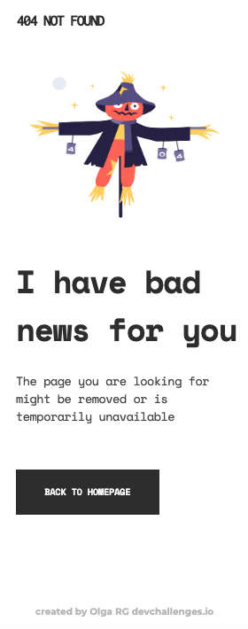
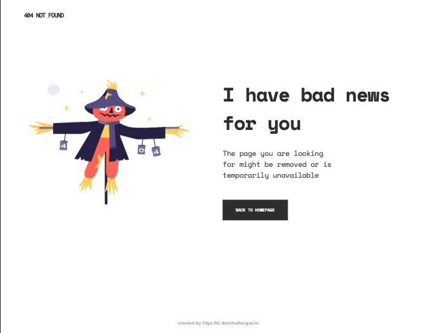
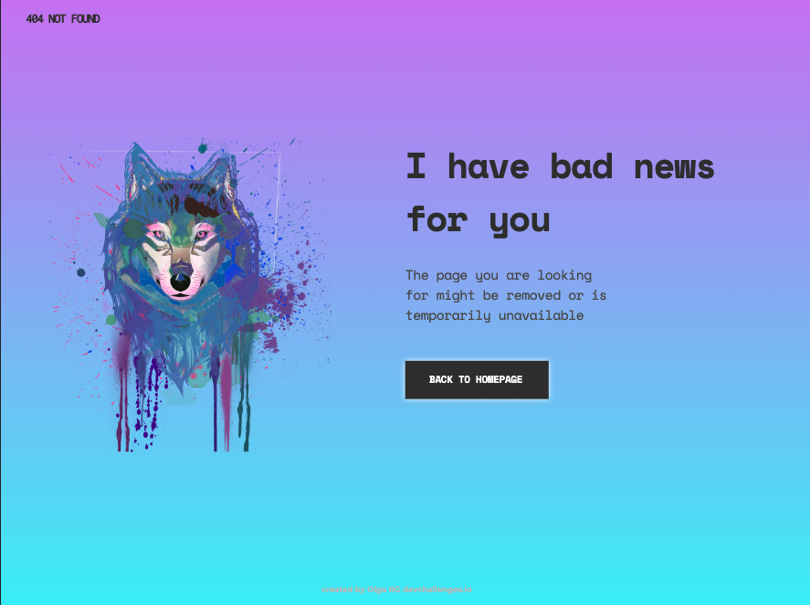
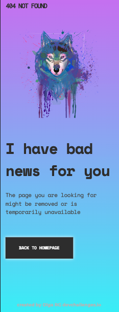

<!-- Please update value in the {}  -->

<h1 align="center">{404 NOT FOUND}</h1>

   Solution for a challenge from  <a href="http://devchallenges.io" target="_blank">Devchallenges.io</a>.

  <h3>
    <a href="https://olguita2412.github.io/404-page-challenge/">
      Demo
    </a>
     | 
    <a href="https://github.com/olguita2412/404-page-challenge">
      Solution
    </a>
     | 
    <a href="https://devchallenges.io/challenges/wBunSb7FPrIepJZAg0sY">
      Challenge
    </a>
  </h3>

<!-- TABLE OF CONTENTS -->

## Table of Contents

- [Overview](#overview)
  - [Built With](#built-with)
- [Features](#features)
- [Contact](#contact)
- [License](#license)

<!-- OVERVIEW -->

## Overview

This proyect has been created for a challenge that consists in create a 404 not found page followin the design given through [figma](https://www.figma.com/file/QeKWLNhB13zDjJzqR22TKE/404-page-challenge?node-id=0%3A1).

The page should be responsive and fullfill the user stories bellow:

- User story: I can see a page following the given design.

Once completed, I give my personal touches by adding transition, using my own images and changing colors.

I have practiced the position of elements with Flexbox, CSS transition and styles and this README.md.

I loved this proyect because it has served me for establish knowledge about HTML and CSS.

If you want to see the final demo of this proyect deployed, you can visit [Demo of the proyect](https://olguita2412.github.io/404-page-challenge/)

### Built With

- [HTML5]
- [CSS3]
- [Visual-Studio-Node] (https://code.visualstudio.com/download) Version: May 2022
- [Git] (https://git-scm.com/download/mac) Version: 2.36.1
- [Git-Hub] (https://github.com/)

## Features

This site was created as a submission to a [DevChallenges](https://devchallenges.io/challenges) challenge. The [challenge](https://devchallenges.io/challenges/wBunSb7FPrIepJZAg0sY) was to build a web responsive to complete the given user stories.

## Contact

- Website [Linkedin](https://{www.linkedin.com/in/olga-rodriguez-garrucho-231152212/})
- GitHub [@olguita2412](https://{github.com/olguita2412})
- Twitter [@olguiita24](https://{twitter.com/olguiita24})

## License

Copyright (c) 2022, Olga RG.
